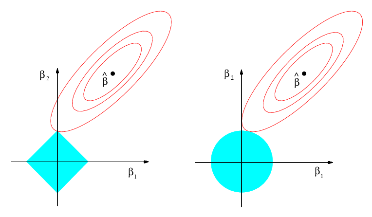
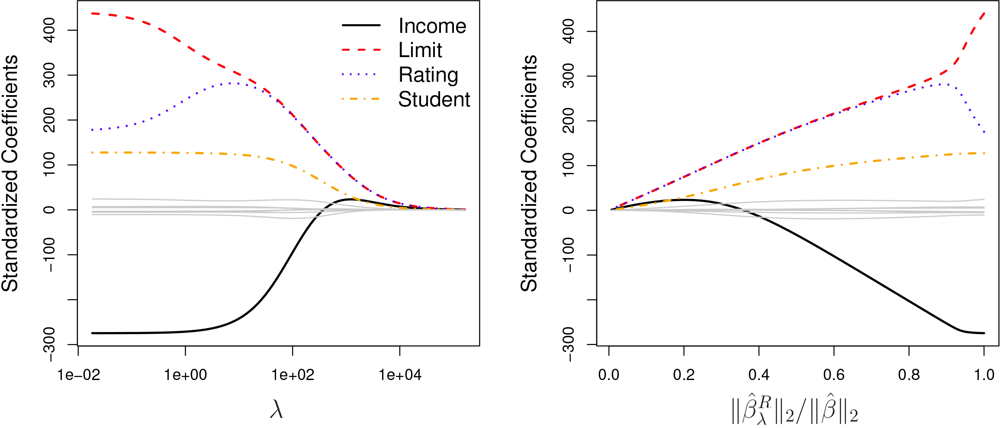
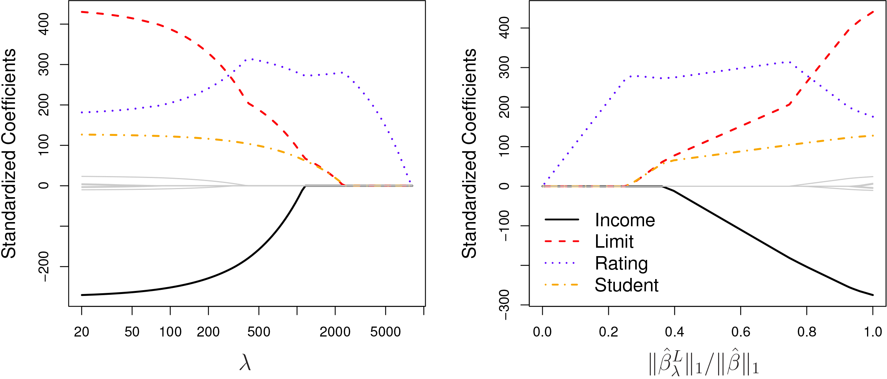
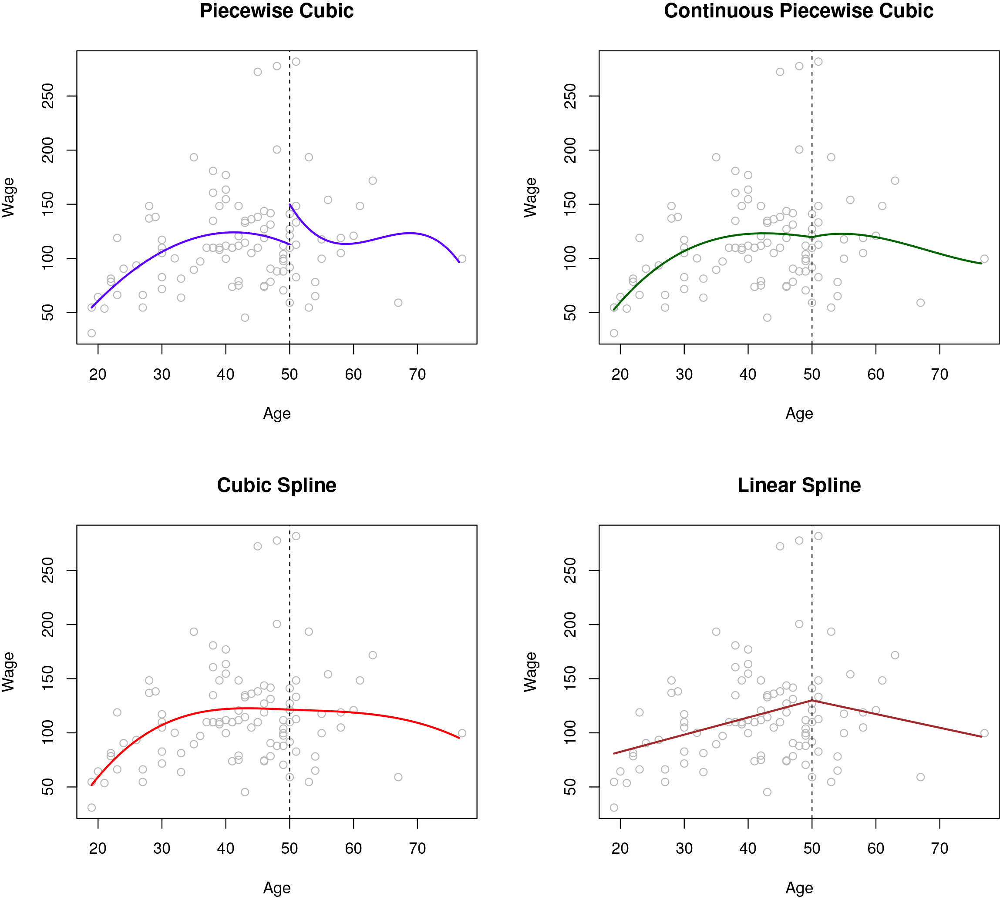

```{r setup, include=FALSE}
knitr::opts_chunk$set(echo = TRUE,tidy=TRUE,message=FALSE,warning=FALSE)
showsol=FALSE
```

<!-- rmarkdown::render("12Final.Rmd","all",encoding="UTF-8") -->
<!-- rmarkdown::render("12Final.Rmd","beamer_presentation",encoding="UTF-8",output_file="12FinalBEAMER.pdf") -->

(08.04: minor adjustments)

# Overview

* course content and learning outcome
* reading list
* overview of modules and core course topics (with exam type questions)
* exam: details on the digital exam, different types of exam questions and exam preparation
* suggestions for statistics-related courses 

---

Some of the figures in this presentation are taken from (or are inspired by) "An Introduction to Statistical Learning, with applications in R"  (Springer, 2013) with permission from the authors: G. James, D. Witten,  T. Hastie and R. Tibshirani.

---

## Added after class

* Class notes [M12L1notes.pdf](https://www.math.ntnu.no/emner/TMA4268/2019v/notes/M12L1notes.pdf)
* Mettes yellow sheet - there ARE misprints - tell Mette when you find a misprint:
[SummingUp2019.pdf](https://www.math.ntnu.no/emner/TMA4268/2019v/12Final/SummingUp2019.pdf)

---

# Course content
Statistical learning, multiple linear regression, classification, resampling methods, model selection/regularization, non-linearity, support vector machines, tree-based methods, unsupervised methods, neural nets.

---

## Learning outcome

1. **Knowledge.** The student has knowledge about the most popular statistical learning models and methods that are used for _prediction_ and _inference_ in science and technology. Emphasis is on regression- and classification-type statistical models.

2. **Skills.** The student knows, based on an existing data set, how to choose a suitable statistical model, apply sound statistical methods, and perform the analyses using statistical software. The student knows how to present the results from the statistical analyses, and which conclusions can be drawn from the analyses. 

And you got to be an expert in using the R language and writing R Markdown reports?

---

# Final reading list

**Textbook:** James, Witten, Hastie, Tibshirani (2013): "An Introduction to Statistical Learning". 

* the whole textbook (436 pages)
* the 12 module pages (remark: module 11 not in the book, and module 1+12 have no "new" material) 
* the compulsory exercises 
    + [Compulsory1](https://www.math.ntnu.no/emner/TMA4268/2019v/Compulsory1.html) [Short solutions](https://www.math.ntnu.no/emner/TMA4268/2019v/CompEx/Compulsory1withLF.html) 
    + [Compulsory2](https://www.math.ntnu.no/emner/TMA4268/2019v/Compulsory2.html) [Short solutions](https://www.math.ntnu.no/emner/TMA4268/2019v/CompEx/Compulsory2solutions.html) 

The short solutions will be available in April and May.

---

1. [Introduction](https://www.math.ntnu.no/emner/TMA4268/2019v/1Intro/1Intro.html)
2. [Statistical learning](https://www.math.ntnu.no/emner/TMA4268/2019v/2StatLearn/2StatLearn.html)* 
3. [Linear regression](https://www.math.ntnu.no/emner/TMA4268/2019v/3LinReg/3LinReg.html)*
4. [Classification](https://www.math.ntnu.no/emner/TMA4268/2019v/4Classif/4Classif.html)*
5. [Resampling methods](https://www.math.ntnu.no/emner/TMA4268/2019v/5Resample/5Resample.html)
6. Linear model selection and regularization (several files, links below)
7. [Moving beyond linearity](https://www.math.ntnu.no/emner/TMA4268/2019v/7BeyondLinear/7.html)*
8. [Tree-based methods](https://www.math.ntnu.no/emner/TMA4268/2019v/8Trees/8Trees.html)
9. [Support vector machines](https://www.math.ntnu.no/emner/TMA4268/2019v/9SVM/9SVM.html)
10. Unsupervised learning (several files, links below)
11. [Neural networks](https://www.math.ntnu.no/emner/TMA4268/2019v/11Nnet/11Nnet.html)*
12. Summing up

Remark: * means that some material is added as compared to the textbook

---

# Core of the course
_build toolbox: how to analyse data (that are not too complex)_

* supervised and unsupervised learning
* supervised: regression and classification
    + examples of regression and classification type problems
    + how complex a model to get the best fit? flexiblity/overfitting/underfitting.
    + the bias-variance trade-off
    + how to find the perfect fit - validation and cross-validation (or AIC-type solutions)
    + how to compare different solutions 
    + how to evaluate the fit - on new unseen data
 * unsupervised: how to find structure or groupings in data?

and of cause all **the methods** (with underlying models) to perform regression, classification and unsupervised learning. We have gained some theoretical understanding, but in some cases deeper theoretical background and understanding of the models is provided in other statistics courses.

---

# The modules

Here we list _topics_ and possible exam-type _questions/problems_. In addition, the recommended exercises are useful to work on - and also the exercises in the textbook.


## 1. [Introduction](https://www.math.ntnu.no/emner/TMA4268/2019v/1Intro/1Intro.html)

### Topics in Module 1

* Examples, the modules, required background in statistics and 
* introduction to R 
    + [Rbeginner](https://www.math.ntnu.no/emner/TMA4268/2019v/1Intro/Rbeginner.html)
    + [Rintermediate](https://www.math.ntnu.no/emner/TMA4268/2019v/1Intro/Rintermediate.html)
    + [Rintermediate with solutions](https://www.math.ntnu.no/emner/TMA4268/2019v/1Intro/Rintermediate-sol.html)

---

## 2. [Statistical learning](https://www.math.ntnu.no/emner/TMA4268/2019v/2StatLearn/2StatLearn.html) 
and solutions to [RecEx](https://www.math.ntnu.no/emner/TMA4268/2019v/2StatLearn/2RecEx-sol.html)

---

### Topics in Module 2

* Model complexity
    + Prediction vs. interpretation.  
    + Parametric vs. nonparametric. 
    + Inflexible vs. flexible.
    + Overfitting vs. underfitting
* Supervised vs. unsupervised. 
* Regression and classification.
* Loss functions: quadratic and 0/1 loss.
* Bias-variance trade-off (polynomial example): mean squared error, training and test set.
* Classification: the Bayes and KNN-classifier
* Vectors and matrices, rules for mean and covariances, the multivariate normal distribution.
* Model complexity and the bias-variance trade-off is important in "all" subsequent modules.

---

### Questions/Problems:

* [Exam in 2018](https://www.math.ntnu.no/emner/TMA4268/Exam/V2018e.pdf): Problem 2
* [Compulsory1 in 2019](https://www.math.ntnu.no/emner/TMA4268/2019v/Compulsory1.html): Problem 3.
* [Compulsory1 in 2018](https://www.math.ntnu.no/emner/TMA4268/2018v/Compulsory1.html): Problem 1.
* What are differences between a supervised and an unsupervised method? List one method of each type and explain briefly which problem they can solve.
* What are the two main types of supervised methods discussed in this course, and how do they differ? List two methods of each type and explain briefly how the two methods are related.

---

## 3. [Linear regression](https://www.math.ntnu.no/emner/TMA4268/2019v/3LinReg/3LinReg.html)
and solutions to [RecEx](https://www.math.ntnu.no/emner/TMA4268/2019v/3LinReg/3LinReg-sol.html)

### Topics in Module 3

* Examples: Munich rent index, ozone, SLID, Framingham heart disease, Boston housing prices, auto.
* The classical normal linear regression model on vector/matrix form.
* Parameter estimators and distribution thereof. Model fit.
* Confidence intervals, hypothesis tests, and interpreting R-output from regression.
* Qualitative covariates, interactions.
* This module is a stepping stone for all subsequent uses of regression in Modules 6, 7, 8, and 11.

---

### Questions/Problems:

* [Compulsory1 in 2019](https://www.math.ntnu.no/emner/TMA4268/2019v/Compulsory1.html): Problem 1.
* [Compulsory1 in 2018](https://www.math.ntnu.no/emner/TMA4268/2018v/Compulsory1.html): Problem 2.
* Theoretical questions are referred to TMA4267 Linear statistical models, but basic knowledge and interpretation of `lm` output important.
* Write down the classical normal multiple regression model in vector and matrix notation. Specify dimensions and explain your notation. Also write down the estimator for the regression coefficients. What is the distribution of this estimator?
* Output from `summary.lm` presented - maybe with question marks in place of number - and you explain and calculate. Interpret two top residual plots!
* What is the "bias-variance decomposition"? Is it applicable to all choices of loss functions? Write down the derivation for quadratic loss for a regression problem at ${\bf x}_0$. Explain your notation.

---

\tiny

```{r,echo=FALSE,eval=TRUE}
data = read.table("https://www.math.ntnu.no/emner/TMA4268/2019v/data/SYSBPreg3uid.txt")
modelA=lm(-1/sqrt(SYSBP) ~ .,data = data)
summary(modelA)
```
\normalsize

---

```{r,eval=TRUE,echo=FALSE}
library(ggplot2)
library(ggpubr)
# residuls vs fitted
gg1=ggplot(modelA, aes(.fitted, .resid)) + geom_point(pch = 21) + 
  geom_hline(yintercept = 0, linetype = "dashed") + 
  geom_smooth(se = FALSE, col = "red", size = 0.5, method = "loess") + 
  labs(x = "Fitted values", y = "Residuals", title = "Fitted values vs. residuals", subtitle = deparse(modelA$call))

# qq-plot of residuals
gg2=ggplot(modelA, aes(sample = .stdresid)) +
  stat_qq(pch = 19) + 
  geom_abline(intercept = 0, slope = 1, linetype = "dotted") +
  labs(x = "Theoretical quantiles", y = "Standardized residuals", title = "Normal Q-Q", subtitle = deparse(modelA$call))

ggarrange(gg1,gg2)
```

---


---

## 4. [Classification](https://www.math.ntnu.no/emner/TMA4268/2019v/4Classif/4Classif.html)
and solutions to [RecEx](https://www.math.ntnu.no/emner/TMA4268/2019v/4Classif/4Classif-sol.html)
(Mainly discussed the two-class problem in this course)

### Topics in Module 4

* Examples: South African heart disease, wine, German credit data, IMDB movie review, MNIST digit classification, iris plants.
* Bayes classifier: classify to the most probable class gives the minimize the expected 0/1 loss. We usually do not know the probability of each class for each input. The Bayes optimal boundary is the boundary for the Bayes classifier and the error rate (on a test set) for the Bayes classifier is the Bayes error rate. Related to the irreducible error (but bias-variance decomposition is for quadratic loss).

---

* Two paradigms (not in textbook): 
      + diagnostic (directly estimating the posterior distribution for the classes)
      + sampling (estimating class prior probabilities and class conditional distribution and then putting together with Bayes rule)
* LDA and QDA: sampling paradigm. Multivariate normal class densities with common covariance (LDA) or class specific covariance (QDA). Class boundaries will be linear (LDA) or quadratic (QDA). Handle easily more than two classes.
* KNN: diagnostic paradigm. Formula for posterior class probability. Overfitting/underfitting and flexibility of class boundary as a function of $K$. Non-linear class boundaries. Handle easily more than two classes.

---

```{r,echo=FALSE,eval=TRUE}
attach(iris)
library(class)
library(MASS)
library(dplyr)
library(ggpubr)

testgrid = expand.grid(Sepal.Length = seq(min(iris[,1]-0.2), max(iris[,1]+0.2), 
              by=0.05), Sepal.Width = seq(min(iris[,2]-0.2), max(iris[,2]+0.2), 
              by=0.05))
iris_lda = lda(Species~Sepal.Length+Sepal.Width, data=iris, prior=c(1,1,1)/3)
res = predict(object = iris_lda, newdata = testgrid)
Species_lda = res$class
postprobs=res$posterior
iris_lda_df = bind_rows(mutate(testgrid, Species_lda))
iris_lda_df$Species_lda = as.factor(iris_lda_df$Species_lda)
iris0_plot = ggplot(iris, aes(x=Sepal.Width, y=Sepal.Length, 
                              color=Species))+geom_point(size=2.5)
irislda_plot = iris0_plot + geom_point(aes(x = Sepal.Width, y=Sepal.Length, 
                            colour=Species_lda), data=iris_lda_df, size=0.8)
iris_qda = qda(Species~Sepal.Length + Sepal.Width, data=iris, prior=c(1,1,1)/3)
Species_qda = predict(object = iris_qda, newdata = testgrid)$class

iris_qda_df = bind_rows(mutate(testgrid, Species_qda))
iris_qda_df$Species_qda = as.factor(iris_qda_df$Species_qda)

gridprobs=

irisqda_plot = iris0_plot + geom_point(aes(x = Sepal.Width, y=Sepal.Length, 
                            colour=Species_qda), data=iris_qda_df, size=0.8)
```

```{r,echo=FALSE}
ggarrange(irislda_plot,irisqda_plot)
```

---

```{r, echo=FALSE, message=FALSE, warning=FALSE}
library(class)
library(dplyr)
library(ggpubr)
set.seed(9)

Sigma = matrix(c(2, 0, 0, 2), 2, 2)

mu1 = c(1, 1)
mu2 = c(3, 3)

X1 = mvrnorm(100, mu=mu1, Sigma=Sigma)
X2 = mvrnorm(100, mu=mu2, Sigma=Sigma)

class = c(rep("A",100), rep("B", 100))
class = as.factor(class)

df = data.frame(rbind(X1, X2), class)

test = expand.grid(x = seq(min(df[,1]-1), max(df[,1]+1), by=0.2), y=seq(min(df[,2]-1), max(df[,2]+1), by=0.2))


## k = 1
classif = knn(df[,1:2], test=test, cl=df[,3], k=1, prob=TRUE)
prob = attr(classif, "prob")

dataf = bind_rows(mutate(test, prob=prob, class="A", prob_cls=ifelse(classif==class, 1, 0)),
                  mutate(test, prob=prob, class="B", prob_cls=ifelse(classif==class, 1, 0)))

gg = ggplot(dataf)+geom_point(aes(x=x, y=y, colour=class), data=mutate(test, class=classif), size=0.01) 
gg = gg + geom_contour(aes(x=x, y=y, z=prob_cls, group=class, color=class), data=dataf, bins=2,size=0.5)
gg = gg + geom_point(aes(x=x, y=y, col=class), size=2, data=data.frame(x=df[,1], y=df[,2], class=df[,3]))
gg = gg + ggtitle("k = 1")+xlab("X1")+ylab("X2")

# k = 3
classif3 = knn(df[,1:2], test=test, cl=df[,3], k=3, prob=TRUE)
prob3 = attr(classif3, "prob")

dataf3 = bind_rows(mutate(test, prob=prob3, class="A", prob_cls=ifelse(classif3==class, 1, 0)),
                    mutate(test, prob=prob3, class="B", prob_cls=ifelse(classif3==class, 1, 0)))

gg3 = ggplot(dataf3)+geom_point(aes(x=x, y=y, colour=class), data=mutate(test, class=classif3), size=0.01)
gg3 = gg3 + geom_contour(aes(x=x, y=y, z=prob_cls, group=class, color=class), data=dataf3, bins=2, size=0.5)
gg3 = gg3 + geom_point(aes(x=x, y=y, col=class), size=2, data=data.frame(x=df[,1], y=df[,2], class=df[,3]))
gg3 = gg3 + ggtitle("k = 3")+xlab("X1")+ylab("X2")

## k = 10

classif10 = knn(df[,1:2], test=test, cl=df[,3], k=10, prob=TRUE)
prob10 = attr(classif10, "prob")

dataf10 = bind_rows(mutate(test, prob=prob10, class="A", prob_cls=ifelse(classif10==class, 1, 0)),
                  mutate(test, prob=prob10, class="B", prob_cls=ifelse(classif10==class, 1, 0)))

gg10 = ggplot(dataf10)+geom_point(aes(x=x, y=y, colour=class), data=mutate(test, class=classif10), size=0.05)
gg10 = gg10 + geom_contour(aes(x=x, y=y, z=prob_cls, group=class, color=class), data=dataf10, bins=2, size=0.5)
gg10 = gg10 + geom_point(aes(x=x, y=y, col=class), size=2, data=data.frame(x=df[,1], y=df[,2], class=df[,3]))
gg10 = gg10 + ggtitle("k = 10")+xlab("X1")+ylab("X2")

## k = 150

classif150 = knn(df[,1:2], test=test, cl=df[,3], k=150, prob=TRUE)
prob150 = attr(classif150, "prob")

dataf150 = bind_rows(mutate(test, prob=prob150, class="A", prob_cls=ifelse(classif150==class, 1, 0)),
                  mutate(test, prob=prob150, class="B", prob_cls=ifelse(classif150==class, 1, 0)))

gg150 = ggplot(dataf150)+geom_point(aes(x=x, y=y, colour=class), data=mutate(test, class=classif150), size=0.05)
gg150 = gg150 + geom_contour(aes(x=x, y=y, z=prob_cls, group=class, color=class), data=dataf150, bins=2, size=0.5)
gg150 = gg150 + geom_point(aes(x=x, y=y, col=class), size=2, data=data.frame(x=df[,1], y=df[,2], class=df[,3]))
gg150 = gg150 + ggtitle("k = 150")+xlab("X1")+ylab("X2")

ggarrange(gg,gg3,gg10,gg150)
```

---

* Logistic regression: mainly used for classification  (even though the name is regression). Diagnostic paradigm. Logistic (sigmoid) function and linear predictor. Interpretation of regression coefficients using odds. Linear class boundaries. Two classes.
* Evaluation with confusion matrix, understanding of ROC-curve and AUC.
* Theory: both LDA and logistic regression.
* This module is a stepping stone module for subsequent use of classification in Modules 8, 9 and 11.

---

```{r, out.width="300pt",echo=FALSE}
knitr::include_graphics("beetleMortality.png")
```

Figure caption: The link function plotted against the probability using the Beetle Mortality dataset from R with parameters $\beta_0 = -60.7$ and $\beta_1=34.3$. The original value for $\eta$ and $\pi$ are included ($\eta = 0, \, \pi = 0.5)$, as well as the cases in which the odds increase ($x_{i1} \rightarrow x_{i1} +1, \, \beta_1 > 0, \, \eta=1, \, \pi=0.729$), and decrease ($x_{i1} \rightarrow x_{i1} -1, \, \beta_1 < 0, \, \eta=-1, \, \pi=0.27$). Figure made by Dag Johnsrud Kristiansen.


---

### Questions/Problems: 

* [Exam in 2018](https://www.math.ntnu.no/emner/TMA4268/Exam/V2018e.pdf): Problem 3 and 4
* [Compulsory1 in 2019](https://www.math.ntnu.no/emner/TMA4268/2019v/Compulsory1.html): Problem 2
* [Compulsory2 in 2019](https://www.math.ntnu.no/emner/TMA4268/2019v/Compulsory2.html): Problem 3
* [Compulsory1 in 2018](https://www.math.ntnu.no/emner/TMA4268/2018v/Compulsory1.html): Problem 3
* [Compulsory3 in 2018](https://www.math.ntnu.no/emner/TMA4268/2018v/Compulsory3.html): Problem 2a

---

* Which are the two paradigms we have presented for classification? Explain briefly how these two differ and identify which of the classification methods that we have discussed in this course belongs to which paradigm. Describe one method from each paradigm briefly.
\small
* Assume we have two classes (class 1 and class 2) and a bivariate input variable (covariate) ${\bf x}$. We now assume that each class conditional distribution is bivariate normal with the same covariance matrix for the two classes. Write down the posterior probability for class 1 (explaining all the parameters that are involved). Then show (yes, derive the result) that the class boundary between class 1 and 2  is linear in the two components of ${\bf x}$. What is the name of this classification method? (This was very similar to the exam question in Problem 3 of the 2018 exam.)
* Given parameter estimates for class means and common covariance matrix (numerical values), use LDA to predict the class of a new observation. (Then pdf in multivariate normal must be given.)
\normalsize

---

* Logistic regression is a classification method for two classes, where the classes are coded $0$ and $1$. Assume we have fitted a logistic regression to a data set with covariates $x_1$ and $x_2$ and that the fitted model is written
$$ \hat{p} = \frac{\exp(1+2\cdot x_1+3\cdot x_2)}{1+\exp(1+2\cdot x_1+3\cdot x_2)}$$
What is the interpretation of $\hat{p}$ (left side) here? What is the interpretation of the regression coefficient $\hat{\beta}_1=2$?
* What is a confusion matrix? What is it used for? How is the misclassification rate defined?
* We have actively used _receiver-operator-curve_ (ROC) and the _area under the curve_ (AUC) in this course. In which types of problems are these used? Explain how a ROC-curve is constructed. If a method gives a AUC of 0.5 when used on a data set, what can you say about this method? 
* Output from fitting a method is presented - you explain and evaluate output, evaluate classification boundaries, interpret ROC-curve and compare methods.

---

\tiny

```{r,echo=FALSE}
library(ElemStatLearn)
library(knitr)
library(kableExtra)
heartds = SAheart
heartds$chd = as.factor(heartds$chd)
glm_heart = glm(chd~., data=heartds, family="binomial")
summary(glm_heart)
```

\normalsize

---

```{r, message=FALSE, warning=FALSE,echo=FALSE}
library(pROC)
set.seed(20)
train_ID = sample(1:nrow(heartds), nrow(heartds)/2)
train_SA = heartds[train_ID, ]
test_SA = heartds[-train_ID, ]
glm_SA = glm(chd~. , data=train_SA, family="binomial")
probs_SA = predict(glm_SA, newdata=test_SA, type="response")
SA_roc = roc(SAheart[-train_ID, 10], probs_SA, legacy.axes=TRUE)
ggroc(SA_roc)+ggtitle("ROC curve")+ 
  annotate("text", x = 0.25, y = 0.30, label = "AUC = 0.7762")

```

---

### The bias-variance trade-off in the classification setting?

* Bias-variance trade-off is for quadratic loss. 
* Generalizations exists - but not covered in this course.
* For classification we tend to think of the Bayes error rate as some kind of lowest possible error rate - similar to the irreducible error. 
* In classification we are also focussed on over/under-fitting, and refer to a method that fits the classification boundary closely as having small bias. 

---

## 5. [Resampling methods](https://www.math.ntnu.no/emner/TMA4268/2019v/5Resample/5Resample.html)
and (handwritten) solutions to [RecEx](https://www.math.ntnu.no/emner/TMA4268/2019v/5Resample/5Resample-sol.pdf)

### Topics in Module 5

* Data rich situation: Training-validation and test set.
* Validation set approach
* How is cross-validation performed? For regression and for classification.
* LOOCV, 5 and 10 fold CV
* good and bad issues with validation set, LOOCV, 10-fold CV
* bias and variance for k-fold cross-validation - end up with k=5 or k=10 fold as good balance?
* selection bias - the right and wrong way to do cross-validation
* bootstrapping to estimate uncertainty in statistic (warming up to Module 8)

---

### Questions/Problems: 

* [Exam in 2018](https://www.math.ntnu.no/emner/TMA4268/Exam/V2018e.pdf): Problem 1
* [Compulsory 1 in 2019](https://www.math.ntnu.no/emner/TMA4268/2019v/Compulsory1.html): Problem 2
* [Compulsory 2 in 2018](https://www.math.ntnu.no/emner/TMA4268/2018v/Compulsory2.html): Problem 1cd

* In a setting where you have access to unlimited amounts of data explain the role of the training set, validation set, and test set. Point to advantages/disadvantages of making such a
division of the data set. Your answer should include the words: model complexity, tuning parameters, overfitting, model fit/parameters.
* In a setting where you have access to limited amount of data explain how $k$-cross-validation can be used for model assessment and model selection. A drawing might be useful.
* Explain what is meant by cross-validation. Discuss its use in practice.
How does cross-validation relate to the use of training/validation/test sets?

---

* Explain how a bootstrap sample is drawn. What is the probability that an observation in our data set will be a part of a given bootstrap sample?
* Assume that we want to fit a regression model. Explain how se can use bootstrapping to estimate the standard deviation of parameters estimates in our model.

---


## 6. Linear model selection and regularization:

* [Lecture 1](https://www.math.ntnu.no/emner/TMA4268/2019v/6selreg/selection_regularization_presentation_lecture1.html) and 
* [Lecture 2](https://www.math.ntnu.no/emner/TMA4268/2019v/6selreg/selection_regularization_presentation_lecture2.html) 
* and solutions to [RecEx](https://www.math.ntnu.no/emner/TMA4268/2019v/6selreg/selection_regularization_recommended_exercises.html)

---

### Topics in Module 6:

* Model selection: estimate performance of different models to choose the best one.
* Model assessment: having chosen a final model, estimate its performance on new data
* Model selection by penalizing the training error: AIC, BIC, $C_p$, Adjusted $R^2$.
* Cross-validation can be used for model selection and assessment.
* Subset selection:
    + best subset selection
    + stepwise model selection

---

* Shrinkage methods
    + ridge regression: quadratic L2 penalty added to RSS 
    + lasso regression: absolute L1 penalty added to RSS
    + no penalty on intercept, not scale invariant: center and scale covariates
* Dimension reduction methods:
    + principal component analysis: eigenvectors, proportion of variance explained, scree plot
    + principal component regression
    + partial least squares (lightly covered)
* High dimensionality issues: multicollinearity, interpretation.

---

### Questions/Problems: 


* [Compulsory 2 in 2019](https://www.math.ntnu.no/emner/TMA4268/2019v/Compulsory2.html): Problem 1
* [Compulsory 2 in 2018](https://www.math.ntnu.no/emner/TMA4268/2018v/Compulsory2.html): Problem 1 and 2
* Print-out from best subset selection, explain how this is done and what the best model is if you use BIC. Explain how you instead (of using BIC) can use cross-validation.
* We have discussed parametric methods where the parameters are found by minimizing the sum of a loss function and a penalty. Choose one such method, write down the loss and penalty used, and explain how this is related to the bias-variance trade-off.
* Interpret figures, explain what you see. What do we call this method?
* Best subset and lasso: [Exam TMA4267V2016 Problem 2d](https://www.math.ntnu.no/emner/TMA4267/2017v/Exam/eV2016E.pdf) with [solutions](https://www.math.ntnu.no/emner/TMA4267/2017v/Exam/eV2016LF.pdf)
* Best subset and lasso: [Exam TMA4267V2014 Problem 2c](https://www.math.ntnu.no/emner/TMA4267/2017v/Exam/eV2014E.pdf) with [solutions](https://www.math.ntnu.no/emner/TMA4267/2017v/Exam/eV2014LF.pdf)

---



---

 

---



---

* Explain how you find the principal components for a given data set, and how these are used in regression. Assume you have $p$ covariates and $n$ observations (where $n>>p$) and you fit a regression model with the first $p$ principal components as regressors. How does this compare to fitting a multiple linear regression to the original covariates? What if you instead only use the first $q$ principal components, where $q<p$.
* MLR, overfitting and principal component regression: [Exam TMA4267K2014 Problem 2](https://www.math.ntnu.no/emner/TMA4267/2017v/Exam/eK2014E.pdf) with [solutions](https://www.math.ntnu.no/emner/TMA4267/2017v/Exam/eK2014LF.pdf)

---

## 7. [Moving beyond linearity](https://www.math.ntnu.no/emner/TMA4268/2019v/7BeyondLinear/7.html) 
and solutions to [RecEx](https://www.math.ntnu.no/emner/TMA4268/2019v/7BeyondLinear/7sol.html)


### Topics in Module 7

* Modifications to the multiple linear regression model - when a linear model is not the best choice. Similar techniques can be used for classification, but we only looked at regression. First look at one covariate, combine in "additive model".
* Basis functions: fixed functions of the covariates (no parameters to estimate)
* Polynomial regression: multiple linear regression with polynomials as basis functions.
* Step functions - piece-wise constants. Like our dummy variable coding of factors.
* Regression splines: regional polynomials joined smoothly - neat use of basis functions. Cubic splines very popular.

---

* Smoothing splines: smooth functions - minimizing the RSS with an additional penalty on the second derivative of the curve. Results in a natural cubic spline with knots in the unique values of the covariate. Complexity parameters chosen by AIC (with degrees of freedom) or cross-validation. (UiO mainly AIC, we mainly cross-validation.)
* Local regressions: smoothed $K$-nearest neighbour with local regression and weighting. In applied areas `loess` is very popular.
* Additive models: combine the above. Sum of (possibly) non-linear instead of linear functions.


---

### Questions/Problems: 

* [Compulsory 2 in 2019](https://www.math.ntnu.no/emner/TMA4268/2019v/Compulsory2.html): Problem 1b
* [Compulsory 2 in 2018](https://www.math.ntnu.no/emner/TMA4268/2018v/Compulsory2.html): Problem 3

* What is the difference between a cubic spline and a natural cubic spline? What would you prefer?
* A smoothing spline is a function minimizing the RSS and an additional penalty. What type of penalty is this? There is a tuning parameter involved - hos can that be chosen? (Details on the smoother matrix and relationship to ridge is beyond the scope here.)
* [UiO 2017 Problem 1c](https://www.math.ntnu.no/emner/TMA4268/2019v/Exam/STK21002017wcomm.pdf) with [solutions](https://www.math.ntnu.no/emner/TMA4268/2019v/Exam/stk2100_2017_fasit.pdf)- but we did not focus on degrees of freedom.

---



<!-- * (MA8701, 2011): We are in a regression setting. -->
<!-- One disadvantage of the nearest-neighbor method is that it usually leads to a discontinuous -->
<!-- $f(x)$. An alternative is the so-called Nadaraya-Watson estimator -->

<!-- $$f(x_0) = \frac{\sum_{i=1}^n K_{\lambda}(x_0, x_i)y_i}{\sum_{i=1}^n K_{\lambda}(x_0, x_i)}$$ -->

<!-- How is the function $K_{\lambda}(x_0, x_i)$ defined? What is the meaning of $\lambda$? -->
<!-- What is the reasoning behind the method? -->

---

## 8. [Tree-based methods](https://www.math.ntnu.no/emner/TMA4268/2019v/8Trees/8Trees.html)
and solutions to [RecEx](https://www.math.ntnu.no/emner/TMA4268/2019v/8Trees/8Trees-sol.html)

---

### Topics in Module 8

* Method applicable both to regression and classification ($K$ classes) and will give non-linear covariate effects and include interactions between covariates. Based on binary splits of each covariate at a time.
* Glossary: root, branches, internal nodes, terminal (leaf) nodes. Tree drawn upside down.
* A tree can also be seen as a division of the covariate space into non-overlapping regions.
* We build a tree from binary splits in one covariate at the time, chosen to improve some measure of error or impurity. The tree is created by not looking ahead - only at the current best split - thus a _greedy strategy_.
* Criterion to minimize
      + Regression: residual sums of squares 
      + Classification: Gini or cross entropy impurity measure or deviance
      
---

* When to stop: decided stopping criterion - like minimal decrease in RSS or less than 10 observations in terminal node.
* Prediction in terminal nodes:
      + Regression: $\hat{y}=\frac{1}{N_j}\sum_{i: x_i \in R_j} y_i$
      + Classification: majority vote or fraction of each class in a node - and cut-off on probabiity. 
* Grow full tree, and then prune back using pruning strategy: cost complexity pruning= cost function + penalty times number of terminal notes (hot handled in detail).

---

* From one tree to many trees= forest. Why? To improve prediction (but this will give worse interpretation).
* Bagging (bootstrap aggregation): draw $B$ bootstrap samples and fit one full tree to each, used the average over all trees for prediction. 
* Random forest: as bagging but only $m$ (randomly) chosen covariates (out of the $p$) are available for selection at each possible split. Rule of thumb for $m$ is $\sqrt{p}$ for classificaton and $p/3$ for regression.
* OOB: out-of-bag estimation can be used for model selection - no need for cross-validation.
* Variable importance plots: give the total amount of decrease in RSS or Gini index over splits of a predictor - averaged over all B trees. May also be calculated over randomization of OOB.
* Boosting: fit one tree with $d$ splits, make residuals and fit a new tree, adjust residuals partly with new tree - repeat. Three tuning parameters chosen by cross-validation.

---


### Questions/Problems: 

* [Exam in 2018](https://www.math.ntnu.no/emner/TMA4268/Exam/V2018e.pdf): Problem 4
* [Compulsory 2 in 2019](https://www.math.ntnu.no/emner/TMA4268/2019v/Compulsory2.html): Problem 1 and 3.
* [Compulsory 3 in 2018](https://www.math.ntnu.no/emner/TMA4268/2018v/Compulsory3.html): Problem 1.
* What does it mean that a method is *greedy*? Mention one greedy method that we have studied and explain why it is greedy. 
* How do we choose that we perform a split in a tree? What is the natural cost function for regression? For classification we focus on node impurity - explain one possible cost function for node impurity.
* Image of tree, explain what you see. Predict the value for a new observation with numerical value given.
* Show full tree and pruned tree and results on test set: compare and argument for which of the models to choose.

---

* How do we choose the number of bootstrap samples $B$ to be used in bagging and random forest? What about boosting?
* Why do we not have to use cross-validation to estimate error rates for bagging and random forest? What do we instead use, and how do we estimate error rates?
* What is boostrapping? We have looked at boostrapping for finding the standard error of an estimator and for bagging and random forest. What is the main idea behind bagging? What is the connection
between bagging and random forests?
* For regression trees - how is a simple way to perform boosting? 

---

## 9. [Support vector machines](https://www.math.ntnu.no/emner/TMA4268/2019v/9SVM/9SVM.html)
and solutions to [RecEx](https://www.math.ntnu.no/emner/TMA4268/2019v/9SVM/9SVM-sol.html).

* SVM is a method for both classification and regression, but we have only studied two-class classification (classes are coded $-1$ and $1$).
* Aim: find high dimensional hyperplan that separates two classes $f({\bf x})=\beta_0+{\bf x}^T \mathbf\beta=0$. If $y_if({\bf x}_i)>0$ observation ${\bf x}_i$ is correctly classified.
* Central: maximizing the distance (on both sides) from the class boundary to the closes observations= the margin $M$ (maximal marginal classifier) - which is relaxed with slack variables (support vector classifiers), and to allow nonlinear functions of ${\bf x}$ by extending an inner product to kernels (support vector machine).
* Support vectors: observations that lie on the margin or on the wrong side of the margin. 

---

* Kernels: generalization of an inner product to allow for non-linear boundaries and to speed up calculations due to inner products only involve support vectors. Most popular kernel is radial $K(x_i,x_i')=\exp(-\gamma\sum_{j=1}^p (x_{ij}-x_{i'j})^2)$.
* Tuning parameters: cost and parameters in kernels - chosen by CV.
* Sad: not able to present details since then a course in optimization is needed.
* Nice connection to non-linar and ridged version of logistic regression - comparing hinge loss to logistic loss - but then without the computational advanges of the kernel method.

---

### Questions/Problems: 


* [Compulsory 2 in 2019](https://www.math.ntnu.no/emner/TMA4268/2019v/Compulsory2.html): Problem 3
* [Compulsory 3 in 2018](https://www.math.ntnu.no/emner/TMA4268/2018v/Compulsory3.html): Problem 2b

* What is a support vector? 
* What are differences between a maximal margin classifier and linear discriminant analysis classifier?
* What are the main differences between the maximal margin classifier and the support vector classifier? Explain the concept of a slack variable.
* What are important aspects of the support vector machine?

---

## 10. Unsupervised learning: 6 files

* [Lecture 1](https://www.math.ntnu.no/emner/TMA4268/2019v/10unsuper/unsupervised_learning_presentation_lecture1.html) with [Lab1](https://www.math.ntnu.no/emner/TMA4268/2019v/10unsuper/1-unsupervised_learning_code_lab1.html) and [New York times stories](https://www.math.ntnu.no/emner/TMA4268/2019v/10unsuper/2-unsupervised_learning_code_nyt_stories.html).
* [Lecture 2](https://www.math.ntnu.no/emner/TMA4268/2019v/10unsuper/unsupervised_learning_presentation_lecture2.html) with [Lab2](https://www.math.ntnu.no/emner/TMA4268/2019v/10unsuper/3-unsupervised_learning_code_lab2.html) and [Lab3](https://www.math.ntnu.no/emner/TMA4268/2019v/10unsuper/4-unsupervised_learning_code_lab3.html)
* and solutions to [RecEx](https://www.math.ntnu.no/emner/TMA4268/2019v/10unsuper/unsupervised_learning_recommended_exercises.html)

### Topics in Module 10

* Principal component analysis: 
     + mathematical details (eigenvectors corresponding to covariance or correlation matrix) also in TMA4267. 
     + understanding loadings and scores and a biplot, choosing the number of principal components from proportion of variance explained or scree-type plots (elbow)
* Clustering:
     + $k$-means: number of clusters given, iterative algorithm to classify to nearest centroid and recalculate centroid
     + hierarchical clustering: choice of distance measure, choice of linkage method (single, average, complete), 

---

```{r,echo=FALSE}
# reading data on consumption of different beverages for countries
drink <- read.csv("https://www.math.ntnu.no/emner/TMA4267/2017v/drikke.TXT",sep=",",header=TRUE)
drink <- na.omit(drink)
# looking at correlation between consumptions
drinkcorr=cor(drink)
pcaS <- prcomp(drink,scale=TRUE) # scale: variables are scaled 
biplot(pcaS,scale=0,cex=0.6) # scale=0: arrows scaled to represent the loadings
```

---

```{r, out.width="300pt",echo=FALSE}
knitr::include_graphics("PCAforQC.png")
```

PCA for quality control

---

```{r, out.width="500pt",echo=FALSE}
knitr::include_graphics("../1Intro/heatmap.png")
```

Hierarchical clustering for visualization

---

### Questions/Problems: 

* [Exam in 2018](https://www.math.ntnu.no/emner/TMA4268/Exam/V2018e.pdf): Problem 5
* [Compulsory 2 in 2019](https://www.math.ntnu.no/emner/TMA4268/2019v/Compulsory2.html): Problem 2
* [Compulsory 3 in 2018](https://www.math.ntnu.no/emner/TMA4268/2018v/Compulsory3.html): Problem 3

* Principal component analysis is both used as an unsupervised method and in a supervised regression setting. Explain briefly how we define the principal components (loadings and scores) and how the principal components are used in the two settings.
* Could also have small numerical task to show that you have understood how to construct a dendrogram, as in Problem 5 of the 2018 exam. 

---

## 11. [Neural networks](https://www.math.ntnu.no/emner/TMA4268/2019v/11Nnet/11Nnet.html)
and solutions to [RecEx](https://www.math.ntnu.no/emner/TMA4268/2019v/11Nnet/11Nnet-sol.html)

---
 
### Topics in Module 11:

* Feedforward network architecture: mathematical formula - layers of multivariate transformed (`relu`, `linear`, `sigmoid`) inner products - sequentially connected. 
* What is the number of parameters that need to be estimated? Intercept term (for each layer) is possible and is referred to as "bias term".
* Loss function to minimize (on output layer): regression (mean squared), classification binary (binary crossentropy), classification multiple classes (categorical crossentropy) — and remember to connect to the correct choice of output activiation function: mean squared loss goes with linear activation, binary crossentropy with sigmoid, categorical crossentropy with softmax.
* How to minimize the loss function: gradient based (chain rule) back-propagation - many variants.

---

* Technicalities: `nnet` in R
* Optional (not on reading list): `keras` in R. Use of tensors. Piping sequential layers, piping to estimation and then to evaluation (metrics).

### Questions/Problems: 

* [Exam in 2018](https://www.math.ntnu.no/emner/TMA4268/Exam/V2018e.pdf): Problem 4, Q17
* [Compulsory 2 in 2019](https://www.math.ntnu.no/emner/TMA4268/2019v/Compulsory2.html): Problem 3
* [Compulsory 3 in 2018](https://www.math.ntnu.no/emner/TMA4268/2018v/Compulsory3.html): Problem 4 
* See RecEx Module 11 for short theoretical questions!

---

## 12. Summing-up (this module)

## Questions/Problems - overall level

* Make a graph with "horisontal axis: Model complexity" and "vertical axis: Interpretability" and position the classification methods we have covered in this course in the graph.
* For many of the methods we have studied, the models are fitted minimizing a sum of a loss function and a tuning parameter times a penalty. Choose one method from regression and one from classification and explain what is the loss function and what is the penalty. Explain what the goal of the penalty is, and how the tuning parameter can be chosen. 

---

* This is Figure 2.7 from @ISL. Explain what is the message of this figure.

```{r, out.width="500pt",echo=FALSE}
knitr::include_graphics("../ISLR/Chapter2/2.7.pdf")
```

---

# Exam and exam preparation


* Supervision before the exam - dates will be decided - tentatively 2hrs in the two weeks starting with May 6 and May 13, and then 2 hrs on May 20 or 21 and on May 22.
* and maybe use the Discussion forum on Bb?

---

## Digital exam

Our exam is an digital exam in Inspera Assessment. 

<https://innsida.ntnu.no/wiki/-/wiki/English/Digital+exam+for+students>

<https://innsida.ntnu.no/wiki/-/wiki/English/Digital+school+exam+-+for+students>

---

Important: 

* You need to have the latest version of Safe Exam Browser (SEB) installed. 
* Go through the test exam to check that your installation is working.
* Linux, android, iOS or ChromeOS are not supported: fill in form to ask for load pc if needed.

Nice: your exam paper is available to you after the exam.

The SEB will make sure that you may only access Inspera - and not any other programmes on your machine or on Internet. This means that R and R Studio will not be available to you at the exam.

**In class:** we looked at a digital exam held in TMA4315 Generelized linear models, to see how you may choose to write with the computer — or on a sheet of paper ("skoleskisser").

---


# The planned exam set-up

We have 30% on the compulsory exercies, and 70% on the written exam. These 70% are 70 points on the written exam.

## Problem types

Since we have a digital exam, there is a possibility to not only use the "ordinary type of written exam". This means:

* For a question of type: "what are the interpretation of an receiver-operator curve?" you may write parts of the answer in an "essay box" and parts on paper (if you want to draw or write equations).
* Build a sentence by choosing from drop-down menues.
* Match equations and figures.
* Four statements, choose the correct statement.
* Calculation task, write the numerical answer for automatic correction.

---

## Topic breakdown

* Regression - 20-50 points
* Classificaiton - 20-50 points
* Unsupervised learning - 0-20 points

- inherently: overfitting and bias-variance trade-off, train/validate/test and cross-validation, assumptions and reasoning behind models and methods, interpretation of results.


---

## Regression problem 


* Explain about a data set and show print-out and residual plots from fitting a multiple linear regression model:
    + interpret, write down formulas, assess model fit.

For example with the Framingham data set from the 2018 [Compulsory exercise 1](https://www.math.ntnu.no/emner/TMA4268/2019v/Compulsory1.html): Problem 2.

```{r,echo=FALSE}
summary(modelA)
```

\normalsize

---
    
* Expand into investigating non-linearities of one or more covariates, present print-out and plots
    + explain, interpret, write down formulas, maybe compare linear vs. non-linear fit

```{r,echo=TRUE}
library(gam)
m2=gam(-1/sqrt(SYSBP) ~ SEX+s(AGE)+CURSMOKE+s(BMI)+s(TOTCHOL)+BPMEDS,data = data)
par(mfrow=c(2,3))
plot(m2)
```

---

* Fitting a penalized solution might improve on prediction accuracy. Explain what is done below and what is the suggested regression model. Write down the function that is minimized to fit this model, and explain how the tuning parameter is chosen.

```{r}
library(glmnet)
x <- model.matrix(modelA)[,-1]
y<- -1/data$SYSBP
fit.lasso=glmnet(x,y)
plot(fit.lasso,xvar="lambda",label=TRUE)
cv.lasso=cv.glmnet(x,y,nfolds=10)
coef(cv.lasso,s="lambda.1se")
```

---

* Then move on to a tree, and look at full (and possibly pruned) tree. Prediction and interpretation. Theoretical questions on the fitting. Predict value for a new observation (numerically): given that a patient has `BPMED=1`, is 30 years of age and has a BMI of 27, what is the predicted value for the `-1/sqrt(SYSBP)`? 

```{r,echo=TRUE}
library(tree)
m3=tree(-1/sqrt(SYSBP) ~ .,data=data)
plot(m3)
text(m3)
```

---

Then a test set should mysteriously appear to be part of a testing regime and you evaluate the results and compare them. 

Other questions might be:

* Improving on trees by bagging or random forest: why would we do that? 
* Can this problem be solved with the use of feedforward neural networks? Suggest a possible architecture (the number of nodes in input and output layer must match the problem, and activiation functions chosen accoringly). What would be your choice of loss function? 
* Comparing different regression solutions with respect to interpretability and prediction accuracy.

---

## Classification problem
 
Explain about a problem with 2 or more classes, for example the South African heart disease data set (from module 4). Traning and test set.

* Write down the fitted model. The estimated coefficient for `famhist` is $1.047$. How can do explain the effect `famhist`? How would you evaluate the fit of this model?

```{r,echo=FALSE}
glm_heart2 = glm(chd~tobacco+famhist+typea+obesity+age, data=train_SA, family="binomial")
summary(glm_heart2)
```

---

* To evaluate the model fit on a new test set an ROC curve is made. How is this curve constructed? Explain what you see and evaluate the goodness of the model.

```{r, message=FALSE, warning=FALSE,echo=FALSE}
probs_heart2 = predict(glm_heart2, newdata=test_SA, type="response")
SA_roc = roc(SAheart[-train_ID, 10], probs_heart2, legacy.axes=TRUE)
ggroc(SA_roc)+ggtitle("ROC curve")+ 
  annotate("text", x = 0.25, y = 0.30, label = "AUC = 0.7762")

```

---

* Another classification method is linear discriminant analysis (LDA). Would LDA be a suitable method for this data set? What are the assumption the LDA classifier is based on?
* Tree and pruned tree also possible here - and bagging and random forests - interpretation and theoretical questions.
* If you were to fit a feedforward neural network to this data set (with the covariates listed above), suggest a possible network architecture. What would be a sensible loss function?

---

## Unsupervised learning problem

* Similar to the two tasks in the [2018 Compulsory 3](https://www.math.ntnu.no/emner/TMA4268/2018v/Compulsory3.html): Problem 3a and 3b -- which is to comment on and recognize method used.
* Could also have small calculation task to show that you have understood concepts, like Problem 5 on the 2018 exam.
* Consider the following four observation of a two-dimensional random vector ${\bf X}=\begin{pmatrix} X_1 \\ X_2\end{pmatrix}$
$$ {\bf a}=\begin{pmatrix}5\\4 \end{pmatrix},
{\bf b}=\begin{pmatrix}1\\-1 \end{pmatrix},
{\bf c}=\begin{pmatrix}-1\\1 \end{pmatrix},
{\bf d}=\begin{pmatrix}4\\0 \end{pmatrix}$$
Calculate the matrix of pairwise Euclidean distances between the points. Use hierarchical clustering with single, complete and average linkage to cluster the points. Draw dendrograms.
Assume that we want two clusters. Which two groups will then the dendrograms give? [M10, exam TMA4270 1995 3a] [Solutions to that exam (scroll to 3a)](https://www.math.ntnu.no/TMA4268/2019v/Exam/75554Des1995LF.pdf)

---

# After TMA4268 - what is next?

What are the statistical challenges we have not covered?

Do you want to learn more about the methods we have looked at in this course? And also methods that are more tailored towards specific types of data? Then we have many statistics courses that you may choose from.

An overview of statistics courses and also information on the statistics staff (for bachelor and master supervision)
<https://folk.ntnu.no/mettela/Talks/3klinfo20190325.html>

---

On behalf of the teaching staff - Michail, Andreas, Thiago and Mette- 

**thank you for attending this course  - hope to see you for the exam supervision - and good luck on May 23!**

---

# References


