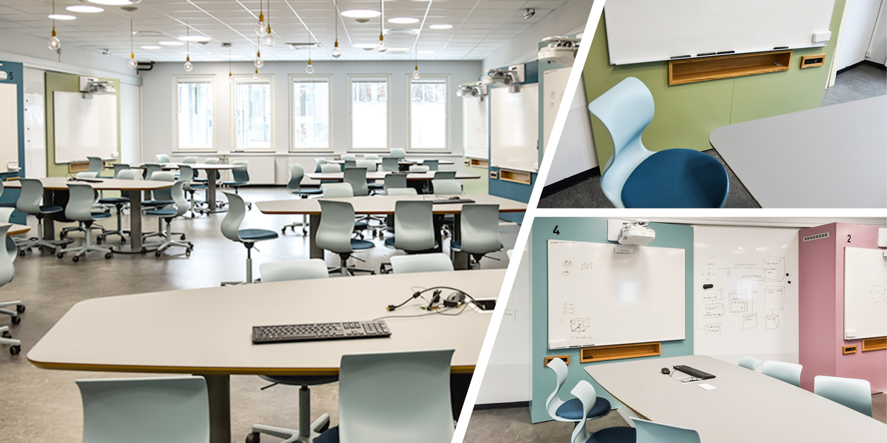
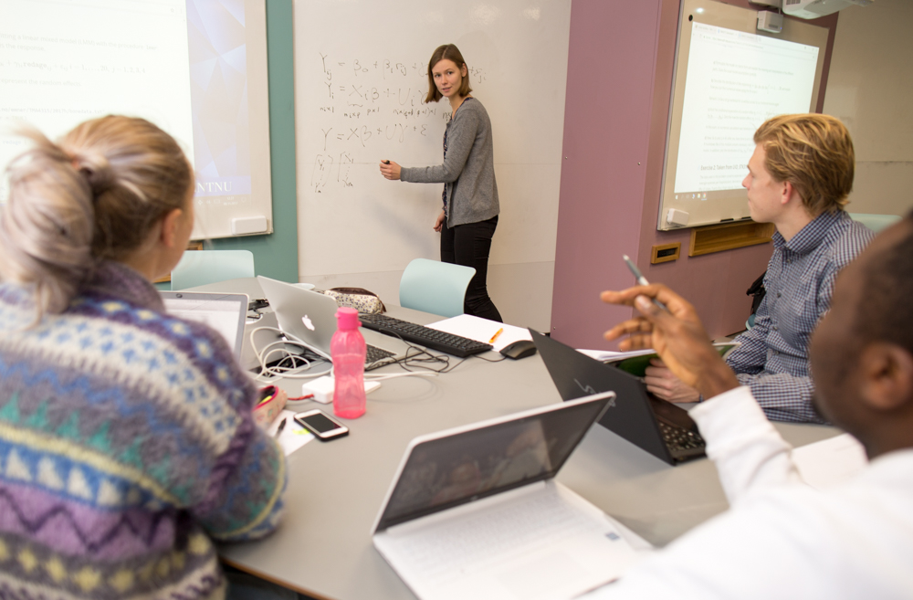
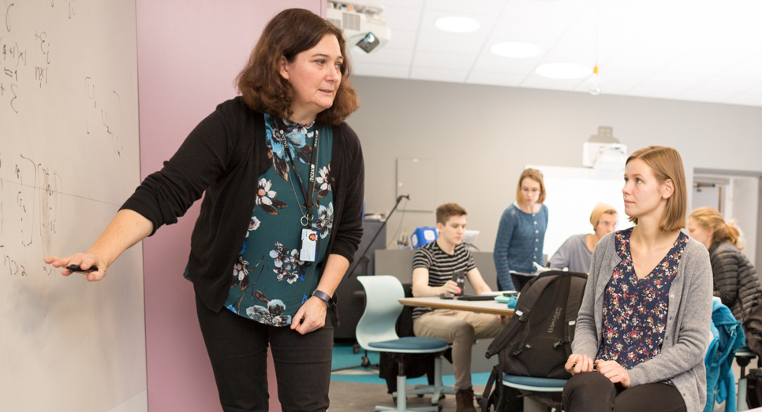

<!-- rmarkdown::render("1Intro/1Intro.Rmd","all",encoding="UTF-8") -->
<!-- rmarkdown::render("1Intro/1Intro.Rmd","html_document",encoding="UTF-8") -->
<!-- rmarkdown::render("1Intro/1Intro.Rmd","pdf_document",encoding="UTF-8") -->
<!-- rmarkdown::render("1Intro/1Intro.Rmd","beamer_presentation",encoding="UTF-8") -->

Last changes: (09.01: added link to Rplots)

```{r setup, include=FALSE}
knitr::opts_chunk$set(echo = TRUE,tidy=TRUE,message=FALSE,warning=FALSE,strip.white=TRUE,prompt=FALSE)
```

# Introduction


## Aims of the module

* what is statistical learning?
* which types of problems will you learn to solve?
* who is this course for: course overview and learning outcome, activities and team
* short presentation of course modules
* more practical details of the course (Blackboard)
* who are you - and what is your background?
* key concepts from your first course in statistics -- that you will need now, mixed with notation for this course
* the role of R and RStudio: introductory course on R with Rbeginner and Rintermediate 

---

## Learning material for this module

* Our textbook James et al (2013): An Introduction to Statistical Learning - with Applications in R (ISL). Chapter 1 and 2.3. 
* [Rbeginner](https://www.math.ntnu.no/emner/TMA4268/2019v/1Intro/Rbeginner.html) and [Rintermediate](https://www.math.ntnu.no/emner/TMA4268/2019v/1Intro/Rintermediate.html)
* Link to background on Matrix Algebra: [Härdle and Simes (2015) - A short excursion into Matrix Algebra](https://link.springer.com/chapter/10.1007/978-3-662-45171-7_2) (on the reading list for TMA4267 Linear statistical models). 

## Added after the lecture

* [Classnotes 07.01.2019](https://www.math.ntnu.no/emner/TMA4268/2019v/notes/M1L1notes.pdf) 

---

# What is statistical learning?

refers to _a vast set of tools to understanding data_ (according to our text book, page 1).

We focus on the whole chain: model-method-algorithm-analysis-interpretation, and we both focus on prediction and understanding (inference). Statistical learning is a statistical discipline.

---

So, what is the **difference between machine learning and statistical learning**?

Well, machine learning is more focused on the algorithmic part of learning, and is a discipline in computer science. 

But, many methods/algorithms are common to the fields of statistical learning and machine learning.

---

## What about data science? 

In data science the aim is to 

* extract knowledge and understanding from data, and 
* requires a combination of statistics, mathematics, numerics, computer science and informatics. 

This encompasses the whole process of data acquisition/scraping, going from unstructured to structured data, setting up a data model, performing data analysis, implementing tools and interpreting results. 

In statistical learning we will not work on the two first above (scraping and unstructured to structured).


[R for Data Science](http://r4ds.had.co.nz/) is an excellent read and relevant for this course!

---

# Problems your will learn to solve

## Main types of problems

There are three main types of problems discussed in this course:

* Regression
* Classification
* Unsupervised methods

using data from science, technology, industry, economy/finance, ...

---

## Regression: etiology of CVD

### Problem and data

The Framingham Heart Study is a study of the etiology (i.e. underlying causes) of cardiovascular disease (CVD), with participants from the community of Framingham in Massachusetts, USA <https://www.framinghamheartstudy.org/>. 
<!--(In Norway we have the Health survey of Nord-Trondelag, HUNT - but not with data available for teaching.)-->

We will focus on modelling systolic blood pressure using data from $n=2600$ persons. For each person in the data set we have measurements of the following seven variables
\footnotesize

* `SYSBP` systolic blood pressure (mmHg),
* `SEX` 1=male, 2=female,
* `AGE` age (years) at examination, 
* `CURSMOKE` current cigarette smoking at examination: 0=not current smoker, 1= current smoker,
* `BMI` body mass index ( $kg/m^2$ ),
* `TOTCHOL` serum total cholesterol (mg/dl), and
* `BPMEDS` use of anti-hypertensive medication at examination: 0=not currently using, 1=currently using.
\normalsize

---

```{r CVDread, eval=TRUE,echo=FALSE,message=FALSE}
#this data set is not publicly available
thisds=dget("https://www.math.ntnu.no/emner/TMA4315/2017h/data/BPtma4267P2.dd")
#dim(thisds)
#colnames(thisds)
thisds$SEX=as.factor(thisds$SEX)
thisds$CURSMOKE=as.factor(thisds$CURSMOKE)
thisds$BPMEDS=as.factor(thisds$BPMEDS)
library(ggplot2)
library(GGally)
ggpairs(thisds, aes(colour=SEX), title="Framingham Heart Study")
```

**Q**: Explain this plot!
Red male and turquoise female (plot and numbers).

---

* Diagonal: density plot (generalization of histogram), or barplot.
* Lower diagonals: scatterplot, histograms
* Upper diagonals: correlations values or boxplots

---

### Etiology of CVD - model 

* A _multiple normal linear regression model_ was fitted to the data set with $-\frac{1}{\sqrt{SYSBP}}$ as response (output) and all the other variables as covariates (inputs). 
* The results are used to formulate hypotheses about the etiology of CVD - to be studied in new trials.

---

\footnotesize
```{r CVDanalyse, eval=TRUE,include=TRUE,message=FALSE,results="hold"}
modelB=lm(-1/sqrt(SYSBP)~SEX+AGE+CURSMOKE+BMI+TOTCHOL+BPMEDS,data=thisds)
summary(modelB)$coeff; summary(modelB)$r.squared;summary(modelB)$adj.r.squared
```

---

\footnotesize

```{r CVDanalyse2, eval=TRUE,include=TRUE,message=FALSE,results="hold"}
summary(modelB)
```
\normalsize

---

## Classification of iris plants

The `iris` flower data set is a multivariate data set introduced by the British statistician and biologist Ronald Fisher in 1936. The data set contains three plant species \{setosa, virginica, versicolor\} and four features measured for each corresponding sample: `Sepal.Length`, `Sepal.Width`, `Petal.Length` and `Petal.Width`.   

---

{width=100px,align=left}


---

\small
```{r iris, include=TRUE}
head(iris)
```
\normalsize

---

Aim: correctly classify the species of an iris plant from sepal length and sepal width.

```{r iriscont, echo=FALSE}
library(ggplot2)
library(GGally)
ggpairs(iris, aes(colour=Species), title="Classification of Iris plants")
# irisplot = ggplot(data=iris, aes(x = Sepal.Length, y = Sepal.Width)) 
# irisplot = irisplot + geom_point(aes(color=Species)) 
# irisplot = irisplot + xlab("Sepal Length") + ylab("Sepal Width")
# irisplot = irisplot + ggtitle("Classification of Iris plants")
# irisplot
```

---

One method: In this plot the small black dots represent correctly classified iris plants, while the red dots represent misclassifications. The big black dots represent the class means.

```{r irislda, echo=FALSE}
library(klaR)
drawparti(iris$Species, iris$Sepal.Length, iris$Sepal.Width,  prec=301, gs=20,  method="lda", image.colors=c("#F8766D", "#00BA38", "#619CFF"), xlab="Sepal Length", ylab="Sepal Width", print.err=0)
legend("topright", title="Species", legend=c("setosa", "versicolor", "virginica"), fill=c("#F8766D", "#00BA38", "#619CFF"),  inset=.02 , cex=0.8)
```

---

Competing method: Sometimes a more suitable boundary is not linear.

```{r irisqda, echo=FALSE}
drawparti(iris$Species, iris$Sepal.Length, iris$Sepal.Width, prec=301, gs=20,  method="qda", image.colors=c("#F8766D", "#00BA38", "#619CFF"), print.err=0, xlab="Sepal Length", ylab="Sepal Width")
legend("topright", legend=c("setosa", "versicolor", "virginica"),title="Species", fill=c("#F8766D", "#00BA38", "#619CFF"),  inset=.02 , cex=0.8)

```

---

## Unsupervised methods: Gene expression in rats

* In a collaboration with researchers the Faculty of Medicine and Health the relationship between inborn maximal oxygen uptake and skeletal muscle gene expression was studied. 
* Rats were artificially selected for high- and low running capacity (HCR and LCR, respectively), 
* and either kept seditary or trained. 
* Transcripts significantly related to running capacity and training were identified (moderated t-tests from two-way anova models, false discovery rate controlled). 
* To further present the findings heat map of the most significant transcripts were presented (high expression are shown in red and transcripts with a low expression are shown in yellow).
* This is hierarchical cluster analysis with pearson correlation distance measure.

---

{width=250px}


More:
<https://www.ncbi.nlm.nih.gov/pmc/articles/PMC2585023/>

---

# Who is this course for?

## Primary requirements
* Bachelor level: 3rd year student from Science or Technology programs, and master/PhD level students with interest in performing statistical analyses.
* Statistics background: TMA4240/45 Statistics, ST1101+ST1201, or equivalent.
* No background in statistical software needed: but we will use the R statistical software extensively in the course. Knowing python will make this easier for you!
* Not a prerequisist but a good thing with knowledge of computing - preferably an introductory course in informatics, like TDT4105 or TDT4110.

---

## Overlap
* TDT4173 Machine learning and case based reasoning: courses differ in philosophy (computer science vs. statistics). See Bb under FAQ for more details.
* TMA4267 Linear Statistical Models: useful to know about multivariate random vectors, covariance matrices and the multivariate normal distribution. Overlap only for Multiple linear regression (M3).

---

## Focus: _both_ statistical theory and running analyses

* The course has focus on _statistical theory_, but all models and methods on the reading list will also be investigated using (mostly) available function in R and real data sets. 
* It it important that the student in the end of the course _can analyses all types of data_ (covered in the course) - not just understand the theory. 
* And vice versa - this is not a "we learn how to perform data analysis"-course - the student must also _understand the model, methods and algorithms used_. 
* There is a final written exam (70% on final grade) in addition two compulsory exercises (30% on final grade).

---

# About the course

## Course content
Statistical learning, multiple linear regression, classification, resampling methods, model selection/regularization, non-linearity, support vector machines, tree-based methods, unsupervised methods, neural nets.

---

## Learning outcome

1. **Knowledge.** The student has knowledge about the most popular statistical learning models and methods that are used for _prediction_ and _inference_ in science and technology. Emphasis is on regression- and classification-type statistical models.

2. **Skills.** The student knows, based on an existing data set, how to choose a suitable statistical model, apply sound statistical methods, and perform the analyses using statistical software. The student knows how to present the results from the statistical analyses, and which conclusions can be drawn from the analyses. 

---

## Learning methods and activities

* Lectures, exercises and works (projects). 
* Portfolio assessment is the basis for the grade awarded in the course. This portfolio comprises a written final examination (70%) and works (projects) (30%). 
The results for the constituent parts are to be given in %-points, while the grade for the whole portfolio (course grade) is given by the letter grading system. Retake of examination may be given as an oral examination. The lectures may be given in English.

**Textbook:** James, Witten, Hastie, Tibshirani (2013): "An Introduction to Statistical Learning". 

**Tentative reading list:** the whole book + the module pages+ two compulsory exercises.

---

## Course team

**Lecturers:**

* Mette Langaas (IMF/NTNU)
* Thiago G. Martins (AIAscience and IMF/NTNU)
* Andreas Strand (NTNU)

**Teaching assistents (TA)**

* Andreas Strand (head TA)
* Michail Spitieris

---

# Teaching philosophy

## The modules

* divide the topics of the course into modular units with specific focus 
* smaller units (time and topic) facilitates learning? 

There will be 12 modules= introduction (this module) + the 10 topics listed previously+ summing up=12 weeks.

---

## The lectures [Mondays at 8.15-10 in S4 and Thursdays at 14.15-16.00 in F6 or Smia]

* We have 2*2hrs of lectures every week (except when working with the compulsory exercises).
* Each week is a new topic and a new module
* Some weeks (modules 2,5,7 and 9) the second lecture is an _interactive lecture_ in Smia, where active learning is in focus (more below).
* The other weeks (modules 3,4,6,8,10 and 11) the second lecture is a plenary lecture in F6.
* The first week of the course the second lecture is replaced by an R workshop!

---

## The weekly supervision sessions [Thursdays 16.15-18 in Smia]

For each module *recommended exercises* are given. These are partly 

* theoretical exercises (from book or not)
* computational tasks
* data analysis

These are supervised in the weekly exercise slots. 

We have joint supervision sessions with the TMA4267 Linear statistical models course. 

TAs from both courses will be present.

---

## The compulsory exercises

* There will be two compulsory exercises, each gives a maximal score of 15 points.
* These are supervised in the weekly exercise slots and there will be one week without lectures (only with supervision) for each compulsory exercise.
* Focus is both on theory and analysis and interpretation in R.
* Students can work in groups (max size 3) and work must be handed in on Blackboard and be written in R Markdown (both .Rmd and .pdf handed in).
* The TAs grade the exercises.
* This gives 30% of the final evaluation in the course, and the written exam the final 70%.

---

## Structure of module pages

1) Introduction and aim
2) Motivating example
3) Theory-example loop
    + statistical theory
    + application of theory to real (and simulated) data using the R language and the RStudio IDE
    + interpretation of results
    + assumptions and limitations of the models and methods
    + extra material wrt theory is either given on the module page or linked to from other sources
    + possible extensions and further reading (beyond the scope of this course) are given in the end of the module page
4) Recommended exercises
5) Previous exam problems
6) References, packages to install.

---

## How to use the module pages?

* A slides version (output: beamer_presentation) of the pages used in the plenary lectures.
* A webpage version (output: html_document) used in the interactive lectures.
* A document version (output: pdf_document) used for student self study.
* The Rmd version - used as notebook to investigate changes to the R code.
* Additional class notes (written in class) linked in.

The module pages are the backbone of the course!

---

# Student active learning

We (probably) all have different ways in which we learn - and we have different learning ambitions when attending a course.

## Felder and Silverman learning styles

Back in 1988 Felder and Silverman published an article where they suggested that there was a mismatch between the way students learn and the way university courses were taught. They devised a taxonomy for learning styles - where four different axis are defined:

---

1) active - reflective: How do you process information: actively (through physical activities and discussions), or reflexively (through introspection)?
2) sensing-intuitive: What kind of information do you tend to receive: sensitive (external agents like places, sounds, physical sensation) or intuitive (internal agents like possibilities, ideas, through hunches)?
3) visual-verbal: Through which sensorial channels do you tend to receive information more effectively: visual (images, diagrams, graphics), or verbal (spoken words, sound)?
4) sequential - global: How do you make progress: sequentially (with continuous steps), or globally (through leaps and an integral approach)?

Here are a few words on the four axis: <http://www4.ncsu.edu/unity/lockers/users/f/felder/public//ILSdir/styles.pdf>

---

The idea in the 1988 article was that by acknowledging these different learning style axes it was possible to guide the teachers to choose teaching styles that matched the learning styles of the students. That is, many students (according to Felder and coauthors) have a visual way of learning, and then teachers should spend time devising visual aids (in addition to verbal aids - that were the prominent aids in 1988), and so on. 
Felder et al have made a standardized set of questions  (44 questions with two possible answers) that you may answer to learn more about your learning style.

Here is the questionnarie (maybe do a screen shot of your results -the results only appear on a web page and is not saved or emailed to you or anyone): <https://www.webtools.ncsu.edu/learningstyles/>

---

After you have notes your scores please go back and read the description of the four axis, but this time focus on the advice for the different type of learners. <http://www4.ncsu.edu/unity/lockers/users/f/felder/public/ILSdir/styles.pdf>

If you are curios about the work of Felder and coauthors, more resources can be found here: <http://educationdesignsinc.com/>

---

## Student active learning in TMA4268

* Students have different background knowledge, learning ambitions and learning styles (verbal/visual, active/reflective, global/sequential, ...).
* Teachers aim to make diverse learning resources available in courses, and
* _promote student active teaching methods_.

**Hypothesis:** Students will learn better/deeper with a combination of different teaching methods.

---

Therefore we aim to:

* Provide learning environments, opportunities, interactions, tasks and instruction that foster deep learning.
* Provide guidance and support that challenges students based on their current ability. 
* Students discover their current strengths and weaknesses and what they need to do to improve. 

We will now focus on _active_ and _reflective_ learning styles and learning methods.

---

## Active vs. reflective learning styles


### What are student reflective learning methods/tasks?

* Plenary lectures
* Reading textbook
* Self study

---

### Plenary lecture

1) The teacher is lecturer
2) Limited amount of interaction student-lecturer
3) Limited amount of interaction student-student
4) Lecturer active, student passive
5) Where: lecture theatre, auditorium
6) Resources: (black)board, screen (for projector), microphone for lecturer, desks in rows.

Positive: _by using the
traditional lecture method, lecturers can present a large amount of material
in a relatively brief amount of time.

Negative: is it also efficient for the student? Maybe efficient for students with a _reflective learning style_?

---

### What are student active learing methods/tasks?

* Pause in plenary lecture to ask questions and let students think and/or discuss.
* In-class quizzes (with the NTNU invention Kahoot!) - individual and team mode.
* Projects - individual or in groups.
* Group discussion
* Interactive lectures

---

### Interactive lecture

1) The teacher is not a lecturer, but an advisor, and teaching assistent (TA) may also be present
2) Focus on interaction student-teacher
3) Focus on interaction student-student
4) Student and teacher/TA both active
5) Where: a room designed for interaction, collaboration and activity
6) Resources: (white)boards, screens, group tables, laptop/PC, possibly a podium for short announcements

Positive: Studens are active. This is how work is done in many cooperative environments (your future workplace?).

Negative: Challenging group processes. Unfamiliar setting for students?

Challenge: requires dedicated space and suitable problems to work on in groups

---

### Innovative learning space: Smia

A room where interaction and activity is in focus. Flat floor with group tables, whiteboard and screen - PC and electricity outlets. 

{width=230px}


<https://www.ntnu.no/laeringsarealer/smia>

---

## Interactive lectures in Smia 

(modules 2,5,7 and 9): Work alone,in pairs, or larger groups (lecturer help to form), introduction (5 min) - work on problem sets (35+, lecturer and TA supervise) - summing up (5 min), pause, repeat. Lecturer interrupts if common confusions or interesting observations by some of the tables.

{width=210px} {width=250px} 


---

# The course modules 

(PL=plenary lecture in S4 (Mondays) or F6 (Thursdays), IL=interactive lecture in Smia, E=exercise in Smia)

A detailed overview is found on Bb, and outside Bb in this [table](https://www.math.ntnu.no/emner/TMA4268/2019v/table2019.html).

### 1. Introduction 
[Ch 1, ML] 2019-w2 (PL: 07.01, R-workshop (IL/E): 10.01)

* About the course
* Key concepts in statistics.
* Intro to R and RStudio

---

### 2. Statistical Learning 
[Ch 2, ML] 2019-w3 (PL: 14.01, IL: 17.01 and E: 17.01)

* Estimating $f$ (regression, classification), prediction accuracy vs model interpretability.
* Supervised vs. unsupervised learning
* Bias-variance trade-off
* The Bayes classifier and the KNN - a flexible method for regression and classification

First hours of IL: bias-variance trade off. Second hour: we target students that doesn't plan to take TMA4267 Linear statistical models, and we work with random vectors, covariance matrices and the multivariate normal distribution (very useful before Modules 3 and 4).

---

### 3. Linear Regression 
[Ch 3, ML] 2019-w4  (PL: 21.01, PL: 24.01 and E: 24.01)

* Simple and multiple linear regression: model assumptions and data sets
* Inference: Parameter estimation, CI, hypotheses, model fit
* Coding of qualitative predictors
* Problems and extensions
* Linear regression vs. KNN.

### 4. Classification 
[Ch 4, ML] 2019-w5  (PL: 28.01, PL: 31.01 and E: 31.01)

* When to use classification (and not regression)?
* Logistic regression
* Linear discriminant analysis LDA and quadratic discriminant analysis QDA
* Comparison of classificators

---

### 5. Resampling methods 
[Ch 5, ML] 2019-w7 (PL: 04.02, IL: 07.02, E: 07.02)

Two of the most commonly used resampling methods are cross-validation and the bootstrap. Cross-validation is often used to choose appropriate values for tuning parameters. Bootstrap is often used to provide a measure of accuracy of a parameter estimate.

* Training, validation and test sets
* Cross-validation
* The bootstrap

---

#### Part 1: Modules 2-5

is finished with compulsory exercise 1. In week 7 we have supervision in Smia 11.02 (8.15-10.00), 14.02 (14.15-18.00).

To be decided: deadline for handing in Compulsory Ex 1. Suggestion: Friday 22.02 at 16?

---

### 6. Linear Model Selection and Regularization 
[Ch 6, TGM] 2019-w8 (PL: 18.02, PL: 21.02, E: 21.02)

* Subset selection
* Shrinkage methods (ridge and lasso)
* Dimension reduction with principal components
* Issues when working in high dimensions

---

### 7. Moving Beyond Linearity 
[Ch 7, AS/ML] 2019-w9 (PL: 25.02, IL: 28.02, E: 28.02 )

* Polynomial regression
* Step functions
* Basis functions
* Regression and smoothing splines
* Local regression
* Generalized additive models

---

### 8. Tree-Based Methods 
[Ch 8, ML/TR] 2019-w10 (PL: 04.03, PL: 07.03, E: 07.03)

* Classification and regression trees
* Trees vs linear models
* Bagging, boosting and random forests


### 9. Support Vector Machines 
[Ch9, ML] 2019-w11 (PL: 11.03, IL: 14.03, E: 14.03)

* Maximal margin classifiers
* Support vector classifiers
* Support vector machines
* Two vs. many classes
* SVM vs. logistic regression

---

### 10. Unsupervised learning 
[Ch 10, TGM] 2019-w12 (PL: 18.03, PL: 21.03, E:21.03)

* Principal component analysis
* Clustering methods


### 11. Neural Networks  
[ML] (PL: 25.03, PL: 28.03, E: 28.03)

* Network design and connections to previous methods
* Fitting neural networks
* Issues in training neural networks

---

### Part 2: Modules 6-11

is finished with compulsory exercise 2. In week 14 we have supervision in Smia 01.04 (8.15-10.00), 04.04 (14.15-18.00).

To be decided: deadline for handing in Compulsory Ex 2. Suggestion: Friday 12.04 at 16?

### 12. Summing up and exam preparation 
[ML] 2019-w15 (PL: 08.04, E:11.04)

* Overview - common connections
* Exam and exam preparation.

---

# Who are you - the students?

In class - go to kahoot.it to answer these questions. Answers in class added, with 51 respondents.

## Study programme 

* MTFYMA FysMat (26)
* BMAT (2)
* MSMNFNA Master in Mathematical Sciences (1)
* Other (21)


## Study year

* 1 or 2 (2)
* 3 (24)
* 4 (18)
* 5, >5 or PhD (7)

---

## Have you/will you take TMA4267 Linear Statistical Models?

* Yes, previously= in 2018 or earlier (5)
* Yes, now= in 2019 (22)
* Yes, planned for 2020 or later (0)
* Not planned (24)

## Do you know R?

* No (34)
* No, and I do not want to learn R (0)
* Yes, but only the basics (13)
* Yes, in depth (3)

---

## Plenary lectures on Monday mornings at 8.15-10 - do you plan to attend?

* Yes (46)
* No, this is too early (2)
* No, since I rarely attend lectures. (2)
* No, for some other reason (1)

## What do you think will be most fun in TMA4268?

* Learning new statistical theory (15)
* Trying out statistical theory in R (14)
* Analysing data (14)
* Learn new hot topics (7)

---

# Practical details
- go to Blackboard

[Guest access](https://ntnu.blackboard.com/webapps/blackboard/execute/modulepage/view?course_id=_7960_1&cmp_tab_id=_40192_1&mode=view)

Course information-Course modules-R resources-Compulsory exercises-Reading list and resources-Exam

AND - **minimum 3 members of the reference groups**:

* IndMat year 3
* Any programme year 4
* Not IndMat

Volunteers?

---

# Key concepts (stats) and notation

Written in class - see class notes linked in in the start of this module page.

---

# Recommended exercises: Focus on R and RStudio

## Thursday January 10 at 14.15-18.00 in Smia 
(Andreas, Michail and Mette present)

* 14.15: Mette explains about the plan for the R workshop 
* 14.15-14.25: Work in groups with overview questions on "R, Rstudio, CRAN and GitHub - and R Markdown"
* 14.25-14.30: Plenum: a few words on what we found and what is useful for us.
* 14.30-15.00: Work alone/in pairs/triplets with [Rbeginner.html](https://www.math.ntnu.no/emner/TMA4268/2019v/Rbeginner.html)  and/or [Rintermediate.html](https://www.math.ntnu.no/emner/TMA4268/2019v/Rintermediate.html).
* 15.00-15.15: Break - serve fruits on table 1.
* 15.15-18.00: Continue to work with [Rbeginner.html](https://www.math.ntnu.no/emner/TMA4268/2019v/Rbeginner.html) and [Rintermediate.html](https://www.math.ntnu.no/emner/TMA4268/2019v/Rintermediate.html).

Mette will interrupt and talk in plenum only if there are common issues that all need to know/pay attention to.

---

## R, Rstudio, CRAN and GitHub - and R Markdown 

1) What is R?
<https://www.r-project.org/about.html>

2) What is RStudio?
<https://www.rstudio.com/products/rstudio/>

3) What is CRAN?
<https://cran.uib.no/>

4) What is GitHub and Bitbucket? Do we need GitHub or Bitbucket in our course?
<https://www.youtube.com/watch?v=w3jLJU7DT5E> and
<https://techcrunch.com/2012/07/14/what-exactly-is-github-anyway/>

5) What is R Markdown?

1-minute introduction video: <https://rmarkdown.rstudio.com/lesson-1.html>

Then, if more is needed also a chapter from the Data Science book: <http://r4ds.had.co.nz/r-markdown.html>

We will use R Markdown for writing the Compulsory exercise reports in our course.

6) What is `knitr`?
<https://yihui.name/knitr/>

---

## A first look at R and R studio

* [Rbeginner.html](https://www.math.ntnu.no/emner/TMA4268/2019v/1Intro/Rbeginner.html) 
* [Rbeginner.pdf](https://www.math.ntnu.no/emner/TMA4268/2019v/1Intro/Rbeginner.pdf) 
* [Rbeginner.Rmd](https://www.math.ntnu.no/emner/TMA4268/2019v/1Intro/Rbeginner.Rmd) 

---

## A second look at R and probability distributions

* [Rintermediate.html](https://www.math.ntnu.no/emner/TMA4268/2019v/1Intro/Rintermediate.html)
* [Rintermediate.pdf](https://www.math.ntnu.no/emner/TMA4268/2019v/1Intro/Rintermediate.pdf)
* [Rintermediate.Rmd](https://www.math.ntnu.no/emner/TMA4268/2019v/1Intro/Rintermediate.Rmd)

To see solutions added to the files, add -sol to filename to get
* [Rintermediate-sol.html](https://www.math.ntnu.no/emner/TMA4268/2019v/1Intro/Rintermediate-sol.html)


## And resources about plots 

* [Rplots.html](https://www.math.ntnu.no/emner/TMA4268/2019v/1Intro/Rplots.html)
* [Rplots.pdf](https://www.math.ntnu.no/emner/TMA4268/2019v/1Intro/Rplots.pdf)
* [Rplots.Rmd](https://www.math.ntnu.no/emner/TMA4268/2019v/1Intro/Rplots.Rmd)

To see solutions added to the files, add -sol to filename to get
* [Rplots-sol.html](https://www.math.ntnu.no/emner/TMA4268/2019v/1Intro/Rplots-sol.html)

---

## For the more experienced R user

* R tutorial on programming - so that you check that you are up to speed on this before we start: <https://tutorials.shinyapps.io/04-Programming-Basics/#section-welcome>

### Data science `learnR` resources

* [Data basics, R for Data Science 5.1](https://jjallaire.shinyapps.io/learnr-tutorial-01-data-basics/)
* [Filtering data, R for Data Science 5.2](https://jjallaire.shinyapps.io/learnr-tutorial-03a-data-manip-filter/)
* [Create new variables, R for Data Science 5.5](https://jjallaire.shinyapps.io/learnr-tutorial-03b-data-manip-mutate/)
* [Summarize data, R for Data Science 5.6](https://jjallaire.shinyapps.io/learnr-tutorial-03c-data-manip-summarise/)

---

## R resources

* P. Dalgaard: Introductory statistics with R, 2nd edition, Springer, which is also available freely to NTNU students as an ebook: [Introductory Statistics with R](http://link.springer.com/book/10.1007%2F978-0-387-79054-1).

* Grolemund and Hadwick (2017): "R for Data Science",  <http://r4ds.had.co.nz>

* Hadwick (2009): "ggplot2: Elegant graphics for data analysis" textbook: <https://link.springer.com/book/10.1007%2F978-0-387-98141-3>

* R-bloggers: <https://https://www.r-bloggers.com/> is a good place to look for tutorials.

* [Overview of cheat sheets from RStudio](https://www.rstudio.com/resources/cheatsheets/)

* Looking for nice tutorials: try [Rbloggers!](https://www.r-bloggers.com/)

* Questions on R: ask the course staff, fellow students, and [stackoverflow](https://stackoverflow.com/) 
might be useful.

# R packages

If you want to look at the .Rmd file and `knit` it, you need to first install the following packages (only once).

```{r eval=FALSE,include=TRUE}
install.packages("ggplot2")
install.packages("klaR")
install.packages("GGally")
```

# Acknowledgements

Thanks to Julia Debik for contributing to this module page.